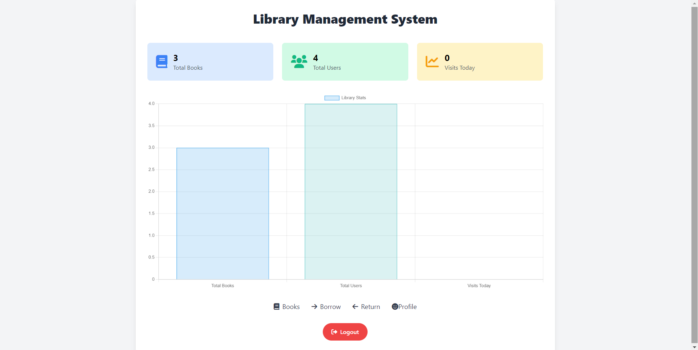

# Library Management System



This is a Library Management System developed in PHP and MySQL. The system allows for the management of books and users, with two main roles: Admin and User. 

## Features

### Dashboard
- **Header**: The dashboard title.
- **Key Metrics**: The dashboard prominently displays key metrics, including the total number of users, books, and daily visits (transactions).
- **Navigation Bar**: The dashboard features a user-friendly navigation bar positioned at the bottom for easy access. The navigation options dynamically adjust based on user roles (Admin or User) to ensure a streamlined experience.

### Admin
- **Add Books**: Admins can add new books to the library.
- **Edit Books**: Admins can edit details of existing books.
- **Delete Books**: Admins can remove books from the library.
- **Manage Users**: Admins can add, edit, and delete user accounts.
- **Return Books**: Admins can mark books as returned by users.

### User
- **View Books**: Users can view the list of available books in the library.
- **Borrow Books**: Users can borrow books from the library.
- **Return Books**: Users can mark books as returned.

## Installation

1. **Clone the repository**
   ```sh
   git clone https://github.com/SOMATECH-20/library-management-system.git
   cd library-management-system
2. **Set up the database**

  - Import the lms.sql file located in the database folder into your MySQL database.
3. **Configure the database connection**

  - Update the database configuration in [`db.php`](config/db.php)
    ```php
    <?php
    $servername = "localhost";
    $username = "root";
    $password = "";
    $dbname = "lms";
    ?>
    ```
4. **Start the server**

* If you are using XAMPP, place the project folder in the **`htdocs`** directory.
* Start the Apache and MySQL modules from the XAMPP control panel.
* Open your web browser and go to **`http://localhost/library-management-system.`**

## Usage

**Admin**
1. **Login**: Admins can log in with their credentials.
2. **Dashboard**: Admins can access the dashboard to manage books and users.
3. **Manage Books**: Add, edit, or delete books from the library.
4. **Manage Users**: Add, edit, or delete user accounts.
5. **Return Books**: Mark books as returned by users.
   
**User**
1. **Login**: Users can log in with their credentials.
2. **View Books**: Browse the list of available books.
3. **Borrow Books**: Borrow books from the library.
4. **Return Books**: Mark borrowed books as returned.

## Project Structure
```arduino
library-management-system/
│
├── assets/
|
├── lms.sql
│
├── modules/
│   ├── add_book.php
│   ├── edit_book.php
│   ├── delete_book.php
│   ├── users.php
│   ├── return.php
│   └── profile.php
│
├── config/
│   └── db.php
│
├── auth/
│   ├── login.php
│   └── logout.php
│
├── index.php
├── LICENSE
├── .gitignore
└── README.md
```

## License
This project is licensed under the MIT License - see the [`LICENSE`](LICENSE) file for details.

## Acknowledgements
- Thanks to the contributors and community for their support.
- Icons by [`Font Awesome`](https://fontawesome.com/).
- CSS framework by [`TailwindCSS`](https://tailwindcss.com/).
Happy Coding!
